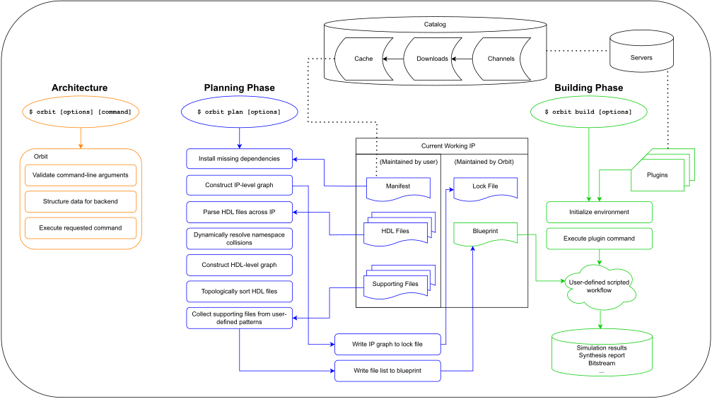

# Key Concepts

Orbit is a frontend package manager for HDL development that supports any backend tooling and workflow.

## Key points

- Every IP requires a manifest file (`Orbit.toml`). This is maintained by the developer. The manifest file documents basic metadata and the project's list of direct dependencies.

- Backend tools and workflows (makefiles, TCL scripts, etc.) are able to be decoupled from IP and can be reused across projects by defining plugins in the configuration file (`config.toml`).

- Orbit does not require a version control system (VCS). Orbit is intended to work with any VCS (git, mercurial, svn, etc.).

- Orbit solves the namespace collision problem by a form of name mangling when primary design unit identifiers conflict in the dependency tree (_dynamic symbol transformation_).

- Download an IP to store a compressed snapshot of a particular version to install later. Downloads are placed in a hidden directory abstracted away from the user and maintained by Orbit.

- Install an IP to the cache to reuse it in another project (`orbit install`). The cache is a hidden directory abstracted away from the user and maintained by Orbit.

- Orbit generates a lock file (`Orbit.lock`) during the planning phase (`orbit plan`) after resolving the dependency tree to store all the data required to reproduce the build. The lock file is maintained by Orbit and must be checked into version control.

- Orbit generates a blueprint file (`blueprint.tsv`) during the planning phase which lists the in-order HDL files required to build the design. The blueprint may also list other user-defined filesets. The blueprint file is maintained by Orbit. It changes frequently and is placed in the build directory, so it should not be checked into version control.

- In general, plugins will read the blueprint file to analyze the source files and then perform some action using a particular backend tool.

- It is required to plan a design (`orbit plan`) before building a design (`orbit build`).

- Launching a new version (`orbit launch`) performs a series of checks to make sure the version will work with Orbit when being referenced in other projects.